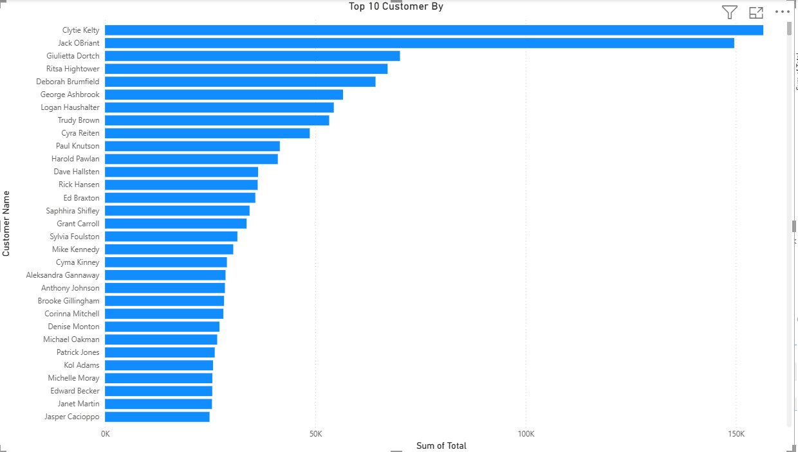

# Retail-Sales-Analysis
Retail Sales Analysis Project

This project analyzes a retail sales dataset using SQL, Python, and Power BI. It aims to derive meaningful business insights from sales, customer behavior, and profitability data.

🔍 Objective

To explore and analyze retail sales data to identify key business metrics and generate visual reports for business decision-making.

🗂 Project Structure

retail-sales-analysis/
├── data/
│   └── retails.csv
├── sql_queries/
│   └── business_analysis.sql
├── python_notebooks/
│   └── retail_analysis.ipynb
├── powerbi_reports/
│   └── retail_dashboard.pbix
├── images/
│   ├── top_customers.png
│   ├── sales_trend.png
│   ├── revenue_by_state.png
│   ├── profitable_categories.png
│   ├── avg_discount_by_category.png
│   ├── shipping_mode_impact.png
│   ├── profitable_customer_type.png
│   ├── discount_vs_profit.png
│   ├── high_discount_low_profit.png
│   └── profit_by_priority.png
├── README.md

🧾 Technologies Used

SQL (MySQL Workbench) for data querying

Python (Pandas, Matplotlib, Seaborn) for data cleaning and visualization

Power BI for dashboard and report creation

GitHub for version control and project showcase

📊 Key Business Questions, SQL Queries, and Visualizations

1. Top 10 Customers by Total Purchase Amount

SQL Query:

SELECT `Customer Name`, SUM(`Total`) AS `Total Purchase Amount`
FROM retails
GROUP BY `Customer Name`
ORDER BY `Total Purchase Amount` DESC
LIMIT 10;

Visualization:

2. States with Highest Total Revenue

SQL Query:

SELECT `State`, SUM(`Total`) AS `Total Revenue`
FROM retails
GROUP BY `State`
ORDER BY `Total Revenue` DESC;

Visualization:

3. Monthly Sales Trends

SQL Query:

SELECT DATE_FORMAT(`Order Date`, '%Y-%m') AS `Month`, SUM(`Total`) AS `Monthly Sales`
FROM retails
GROUP BY `Month`
ORDER BY `Month`;

Visualization:

4. Most Profitable Product Categories

SQL Query:

SELECT `Product Category`, SUM(`Profit Margin`) AS `Total Profit`
FROM retails
GROUP BY `Product Category`
ORDER BY `Total Profit` DESC;

Visualization:

5. Average Discount per Product Category

SQL Query:

SELECT `Product Category`, AVG(`Discount %`) AS `Average Discount`
FROM retails
GROUP BY `Product Category`;

Visualization:

6. Most Used Shipping Mode & Delivery Impact

SQL Query:

SELECT `Ship Mode`, COUNT(*) AS `Count`, AVG(DATEDIFF(`Ship Date`, `Order Date`)) AS `Avg Delivery Days`
FROM retails
GROUP BY `Ship Mode`;

Visualization:

7. Most Profitable Customer Type

SQL Query:

SELECT `Customer Type`, SUM(`Profit Margin`) AS `Total Profit`
FROM retails
GROUP BY `Customer Type`
ORDER BY `Total Profit` DESC;

Visualization:

8. Discount % vs Profit Margin Correlation

SQL Query:

SELECT `Discount %`, `Profit Margin`
FROM retails;

Visualization:

9. Products Sold at High Discount but Low Profit

SQL Query:

SELECT `Product Name`, AVG(`Discount %`) AS `Avg Discount`, AVG(`Profit Margin`) AS `Avg Profit`
FROM retails
GROUP BY `Product Name`
HAVING `Avg Discount` > 10 AND `Avg Profit` < 20;

Visualization:

10. Profit Margin by Order Priority

SQL Query:

SELECT `Order Priority`, AVG(`Profit Margin`) AS `Avg Profit Margin`
FROM retails
GROUP BY `Order Priority`
ORDER BY `Avg Profit Margin` DESC;

Visualization:

🔮 Future Scope

Add machine learning models for sales prediction

Include customer segmentation using KMeans

Deploy dashboard online using Power BI Service

📌 How to Run

Clone this repository

Open the dataset in the data/ folder

Use MySQL to run queries from sql_queries/

Open the Jupyter notebook to run Python analysis

Open Power BI file for visual dashboard

🙋‍♂️ Author

Your NameEmail: your.email@example.comGitHub: yourusername

